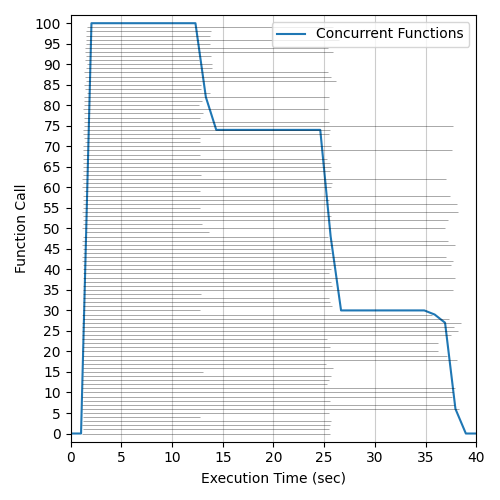
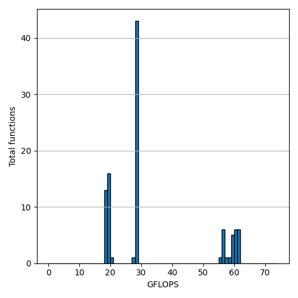
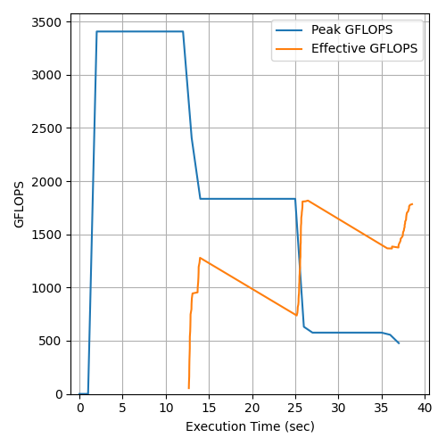
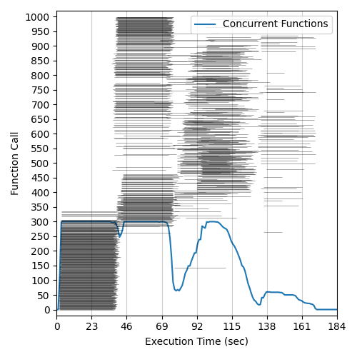
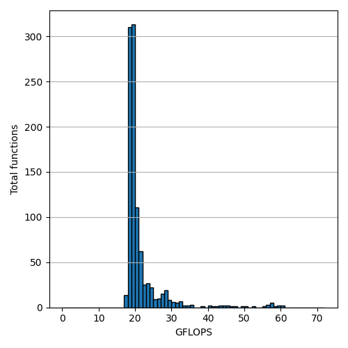
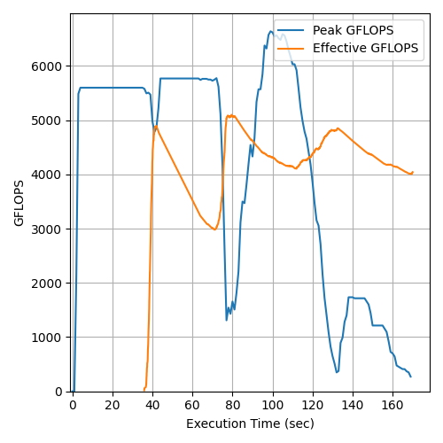

# Aliyun Function Compute Flops Benchmark

## Total Concurrency: 100 - Runtime Memory: 1024MB - Date: 13/05/2020
### Execution Histogram | GFLOP Rates | Peak and Effective GFLOPS

  </img>
  </img>
  </img>

## Total Concurrency: 1000 - Runtime Memory: 1024MB - Date: 13/05/2020
### Execution Histogram | GFLOP Rates | Peak and Effective GFLOPS

  </img>
  </img>
  </img>

