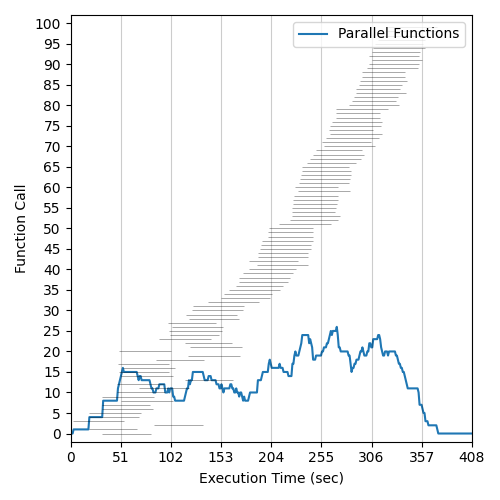
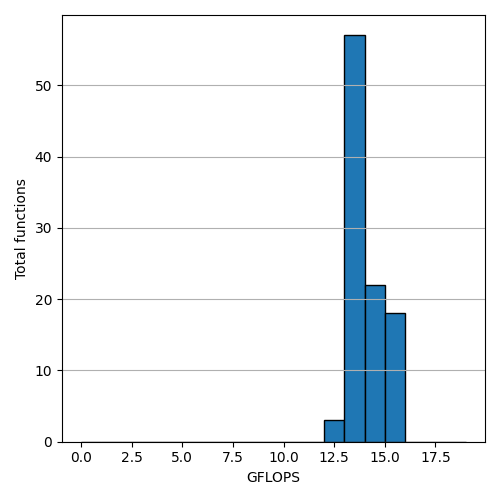
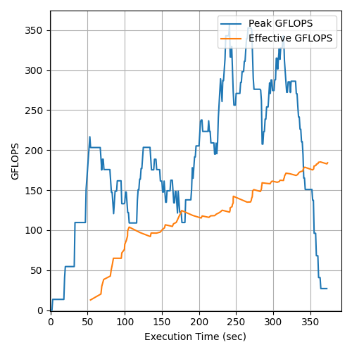

# Microsoft Azure Container Apps Flops Benchmark (westeurope)

## Total Invocations: 100 - Runtime Memory: 1024 - Date: 13/06/2022
### Execution Histogram | GFLOP Rates | Peak and Effective GFLOPS

  </img>
  </img>
  </img>

## Total Invocations: 1000 - Runtime Memory: 1024 - Date: 13/06/2022
### Execution Histogram | GFLOP Rates | Peak and Effective GFLOPS

* **Note**: Azure Container APPs limits the scalability to 30 parallel containers, so the results of the previous benchmark are applicable to any number of invocations >= 30.