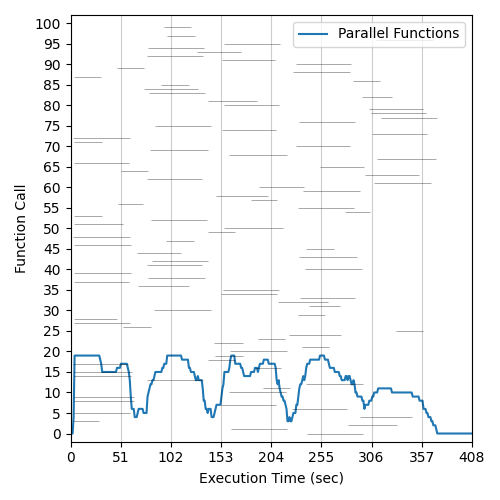
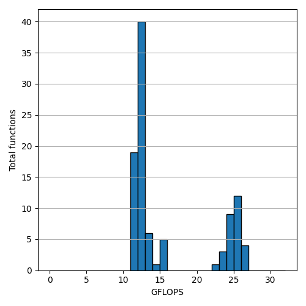
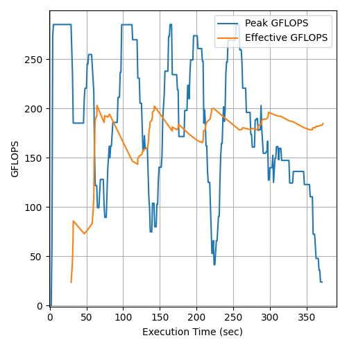
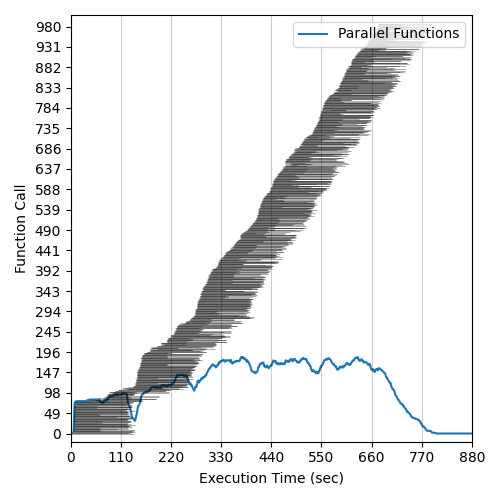
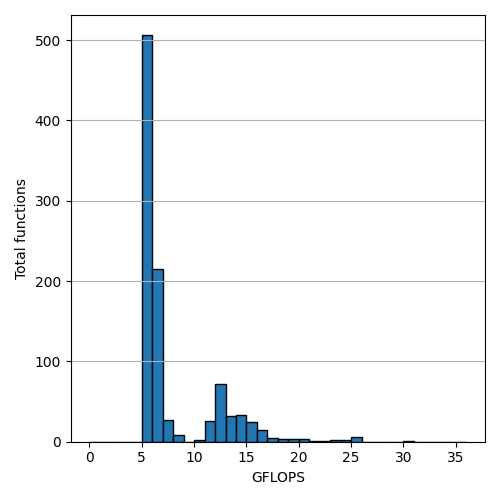
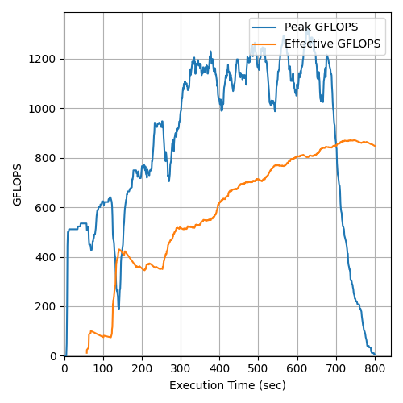

# Microsoft Azure Functions Flops Benchmark (westeurope)
# Date: 11/06/2022
--------

## Total Parallelism: 100 - Runtime Memory: MAX
### Execution Histogram | GFLOP Rates | Peak and Effective GFLOPS

  </img>
  </img>
  </img>

## Total Parallelism: 1000 - Runtime Memory: MAX
### Execution Histogram | GFLOP Rates | Peak and Effective GFLOPS

  </img>
  </img>
  </img>

