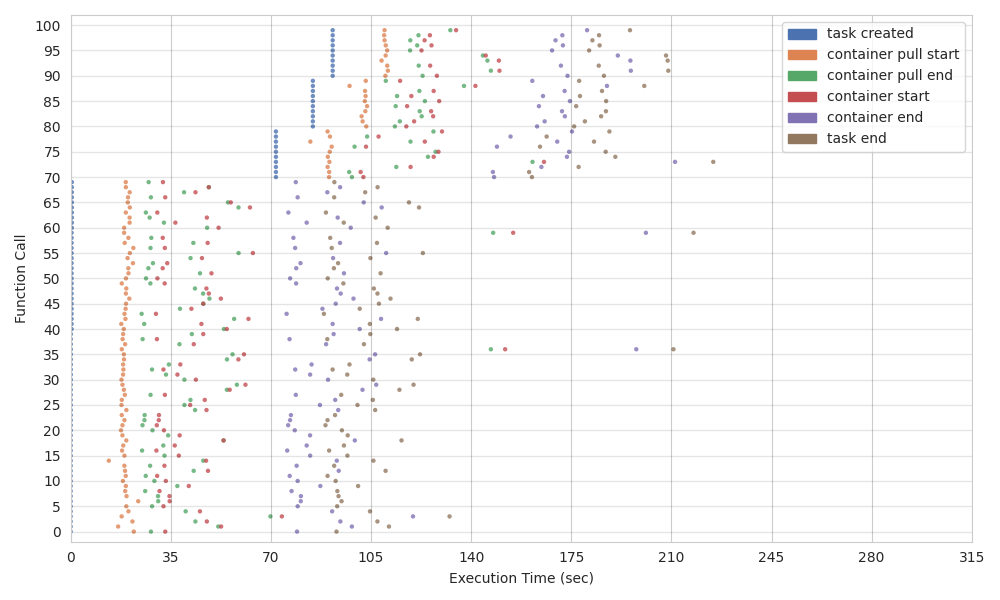
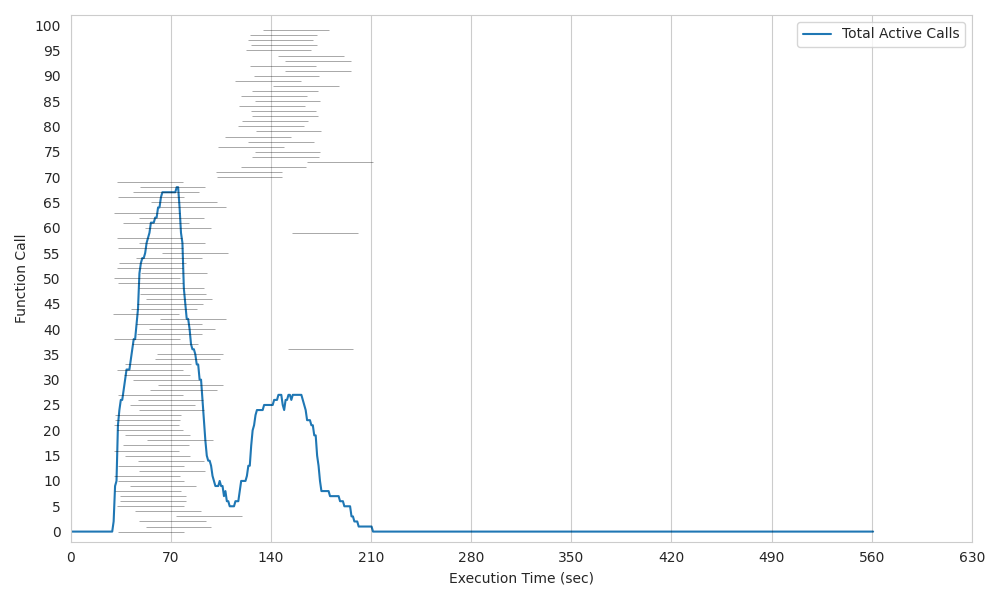

# AWS Fargate

AWS Fargate provides container execution in a serverless basis, without the need to provision or manage an EC2 cluster, and the service is only billed per minute for allocated resources when used.

Although the capability to provide 4 vCPUs and 30 GiB of memory to a container and the ability to perform container networking are interesting features for certain uses, the poor scalability of the service makes it not good enough for PyWren and highly parallel jobs.

When we talk about Fargate Tasks, the main limitation is the maximum number of concurrent containers, which is only 100 if we use the normal Fargate launch type or 250 if we use Fargate Spot. Compared to Lambda where the concurrency can go up to more than 1000 functions, 100 containers seem few in comparison. Moreover, the Fargate API limits the task deployment to 10 at a time every 10 seconds. In addition, the container creation time is considerably higher than that of a lambda function, due to resource provisioning and the overhead of having to pull the container image from the registry.

Fargate Services however, can have 1000 concurrent containers, but the absence of autoscaling to 0 of these means that it is also not well suited for PyWren model of execution.

Sources:

https://docs.aws.amazon.com/AmazonECS/latest/developerguide/service-quotas.html

https://docs.aws.amazon.com/AmazonECS/latest/developerguide/service-autoscaling-targettracking.html

## Execution Timeline | Histogram

  </img>
  </img>

