# Singularity Flops Benchmark (MareNostrum 5)

These plots were obtained using Singularity containers in a set of nodes of [MareNostrum 5](https://www.bsc.es/supportkc/docs/MareNostrum5/overview).

### Overview

The benchmarks were conducted on different node configurations:

* **100 functions benchmark:** Executed on a single node with 112 CPUs, using 2 threads per CPU.
* **1000 functions benchmark:** Executed on 5 nodes, each with 112 CPUs and 2 threads per CPU.
* **11200 functions benchmark:** Executed on **100 nodes**, each with 112 CPUs and 2 threads per CPU.
* **22400 functions benchmark:** Executed on **200 nodes**, each with 112 CPUs and 2 threads per CPU.

## Total Parallelism: 100 - Date: 19/07/2024
### Execution Histogram | GFLOP Rates | Peak and Effective GFLOPS

  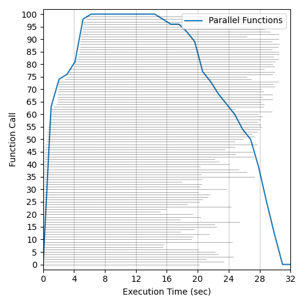</img>
  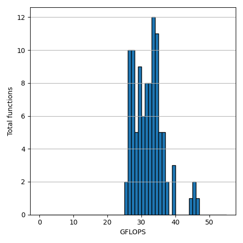</img>
  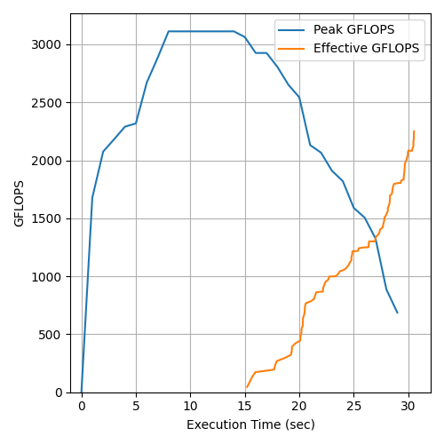</img>

## Total Parallelism: 1000 - Date: 19/07/2024
### Execution Histogram | GFLOP Rates | Peak and Effective GFLOPS

  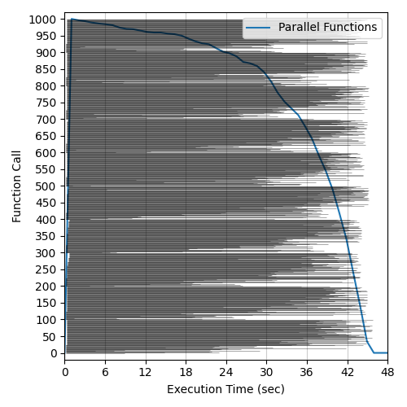</img>
  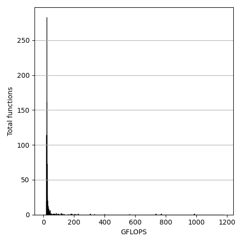</img>
  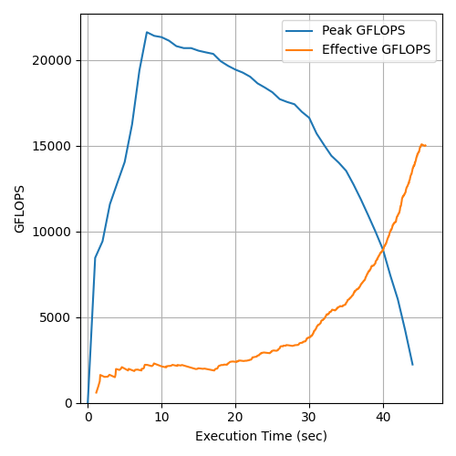</img>

## Total Parallelism: 11200 - Date: 18/09/2024
### Execution Histogram | GFLOP Rates | Peak and Effective GFLOPS

  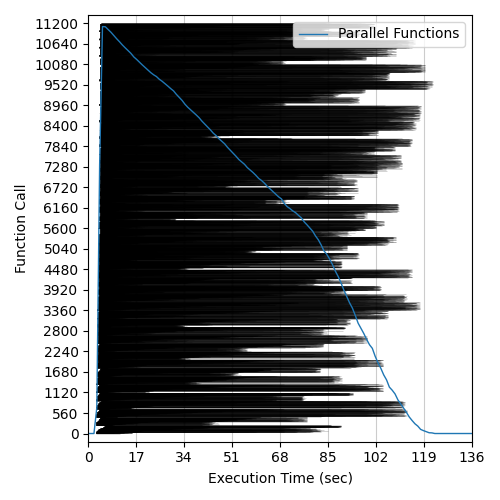</img>
  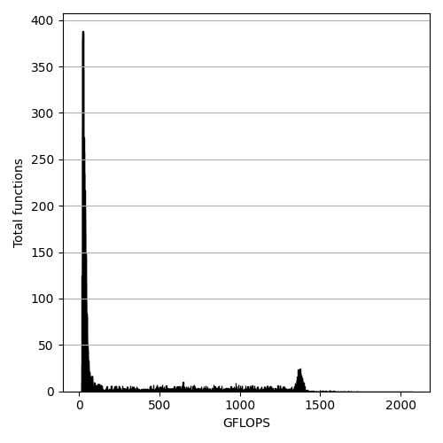</img>
  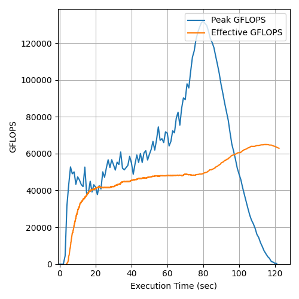</img>

## Total Parallelism: 22400 - Date: 18/09/2024
### Execution Histogram | GFLOP Rates | Peak and Effective GFLOPS

  </img>
  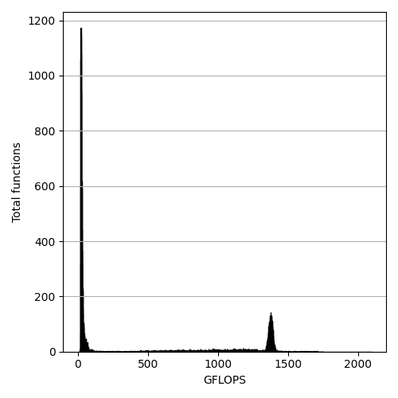</img>
  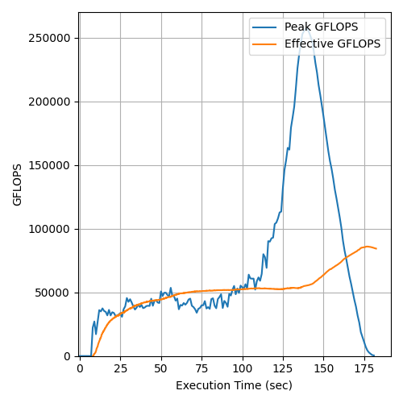</img>

