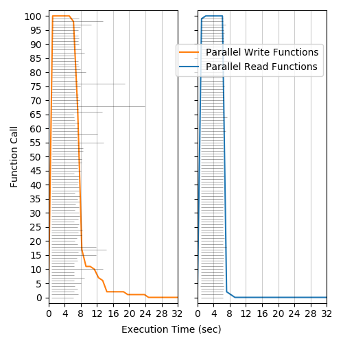
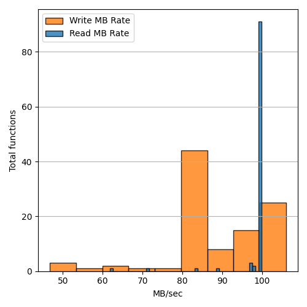
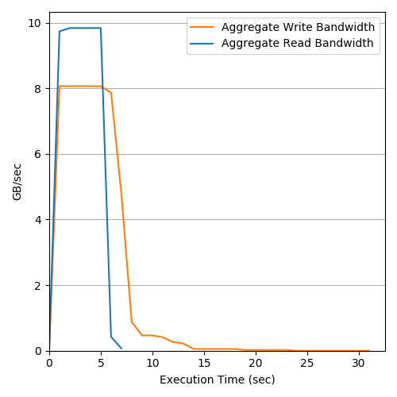
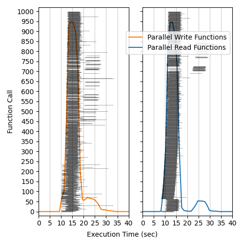
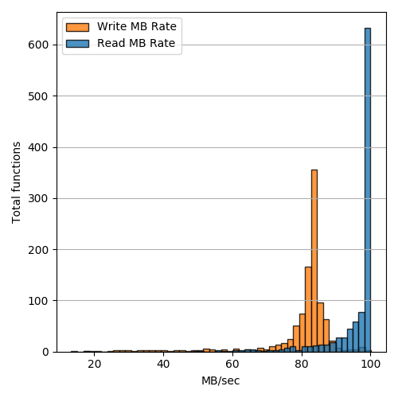
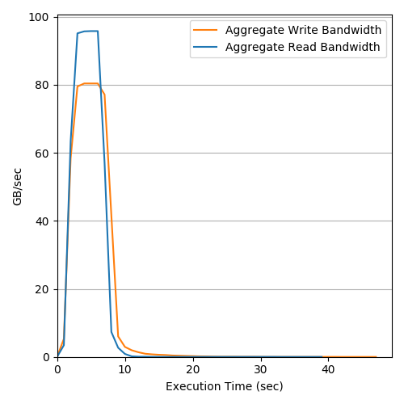

# AWS S3 Bandwidth Benchmark

## Total Concurrency: 100 - Object Size: 512MB - Runtime Memory: 1024MB - Date: 15/5/2020
### Execution Histogram | Write/Read Rates | Aggregate Bandwidth

  </img>
  </img>
  </img>

## Total Concurrency: 1000 - Object Size: 512MB - Runtime Memory: 1024MB - Date: 15/5/2020
### Execution Histogram | Write/Read Rates | Aggregate Bandwidth

  </img>
  </img>
  </img>

