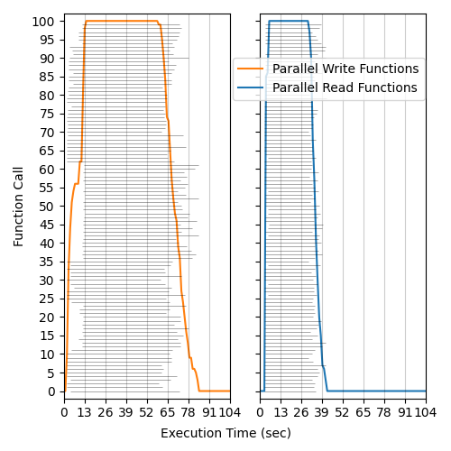
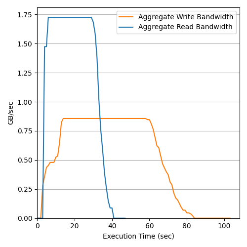
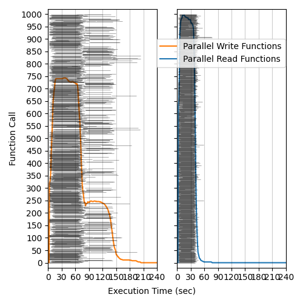
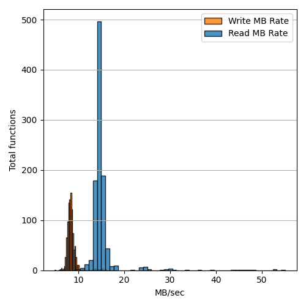
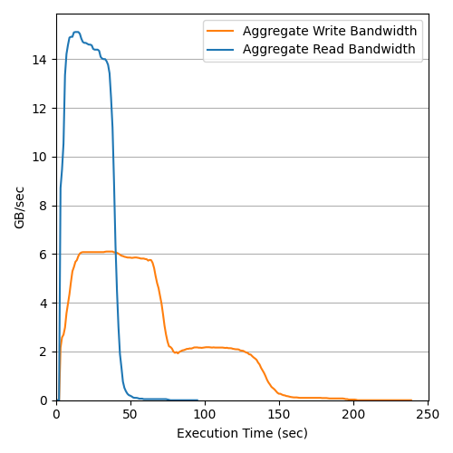

# Google Cloud Functions - Google Cloud Storage Bandwidth Benchmark (us-east1)

## Total Invocations: 100 - Object Size: 512MB - Runtime Memory: 1024MB - Date: 09/06/2022
### Execution Histogram | Write/Read Rates | Aggregate Bandwidth

  </img>
  </img>
  </img>

## Total Invocations: 1000 - Object Size: 512MB - Runtime Memory: 1024MB - Date: 09/06/2022
### Execution Histogram | Write/Read Rates | Aggregate Bandwidth

  </img>
  </img>
  </img>

