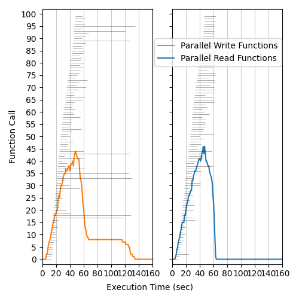
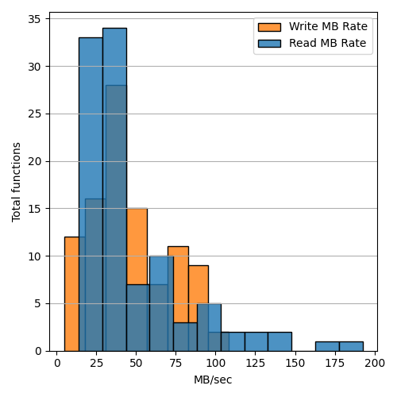
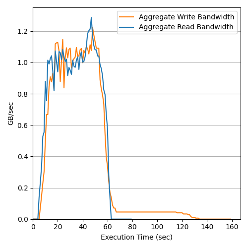

# OVH Managed k8s  - Flops Benchmark (GRA11) - Instance R3-256 (32 CPU 256 GB RAM 400 GB Disk) - Swift Standard OSS

## Total Invocations: 100 - Object Size: 512MB - Runtime Memory: 1024MB - Runtime CPU: 0.5 CPU - Date: 21/05/2024
### Execution Histogram | Write/Read Rates | Aggregate Bandwidth

  </img>
  </img>
  </img>

